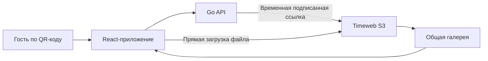

<div align="center">


# Ilya & Anna Wedding Gallery

**Мобильная свадебная галерея для гостей · 06.09.2026**

Гости открывают сайт по QR-коду, загружают фотографии и видео<br>
и сразу видят общую историю праздника.

[Открыть сайт](https://dover191-ilya-anna-wedding-gallery-b0d3.twc1.net/) · [QR-код для печати](./qr/ilya-anna-wedding-qr.png)


</div>

## О проекте

Сайт создан для свадьбы Ильи и Анны. Он рассчитан прежде всего на смартфоны: гостю достаточно отсканировать QR-код, указать имя и поделиться своими кадрами без регистрации.

| Возможность | Как работает |
| --- | --- |
| Загрузка фото и видео | До 50 файлов за один раз, до 300 МБ каждый |
| Общая галерея | Новые материалы появляются в категориях праздника |
| Полноэкранный просмотр | Навигация между кадрами и просмотр видео |
| Любимые кадры | Отметки сохраняются локально на устройстве гостя |
| Скачивание | Каждый файл можно сохранить в исходном качестве |
| Mobile first | Интерфейс адаптирован для перехода по QR-коду со смартфона |

## Как устроено



Файлы отправляются напрямую в Timeweb S3 по временным подписанным ссылкам. Секретный ключ используется только сервером и никогда не передаётся в браузер.

## QR-код

<p align="center">
  <a href="https://dover191-ilya-anna-wedding-gallery-b0d3.twc1.net/">
    
  </a>
  <br>
  <sub>PNG, 2048 × 2048, высокий уровень коррекции ошибок</sub>
</p>

## Структура

```text
src/                 React-интерфейс
cmd/server/          Go API и работа с S3
public/              Статические изображения
qr/                  QR-код для печати
Dockerfile           Сборка и запуск приложения
.env.example         Шаблон переменных окружения
```

<details>
<summary><strong>Локальный запуск</strong></summary>

1. Скопируйте `.env.example` в `.env` и заполните параметры S3.
2. Соберите интерфейс и запустите API:

```bash
npm ci
npm run build
go run ./cmd/server
```

Приложение откроется по адресу `http://localhost:3000`.

</details>

<details>
<summary><strong>Переменные окружения</strong></summary>

```env
MINIO_ENDPOINT=s3.twcstorage.ru
MINIO_ACCESS_KEY=<Timeweb S3 Access Key>
MINIO_SECRET_KEY=<Timeweb S3 Secret Access Key>
MINIO_BUCKET=ilya-anna-wedding
MINIO_USE_SSL=true
MINIO_REGION=ru-1
MINIO_PREFIX=guest-media/2026-09-06
PORT=3000
PRESIGNED_PUT_TTL=15m
PRESIGNED_GET_TTL=1h
MAX_FILE_SIZE=314572800
```

`MINIO_ENDPOINT` указывается без `https://`. `MAX_FILE_SIZE` задаётся в байтах.

> [!IMPORTANT]
> Никогда не добавляйте `MINIO_SECRET_KEY` в исходный код или публичный репозиторий.

</details>

<details>
<summary><strong>Деплой в Timeweb App Platform</strong></summary>

1. Выберите `Docker` → `Dockerfile`.
2. Подключите репозиторий и ветку `main`.
3. Оставьте путь к директории проекта пустым.
4. Добавьте переменные окружения через панель Timeweb.
5. Укажите `/api/health` как путь проверки состояния.
6. Запустите деплой.

После деплоя добавьте HTTPS-адрес приложения в `Allowed Origins` правила CORS бакета. Разрешите методы `GET`, `PUT`, `HEAD`, заголовки `Content-Type` и `x-amz-*`; в `Expose Headers` укажите `ETag`.

</details>

## API

| Метод | Маршрут | Назначение |
| --- | --- | --- |
| `POST` | `/api/uploads/presign` | Создать временную ссылку для загрузки |
| `GET` | `/api/photos` | Получить список медиа и ссылки просмотра |
| `GET` | `/api/health` | Проверить состояние приложения |

---

<div align="center">
Сделано для одного очень важного дня.
</div>
